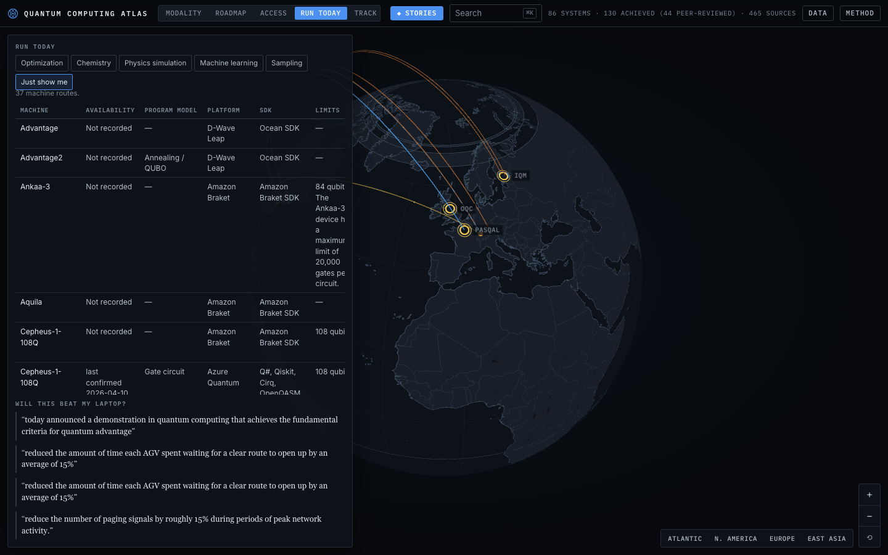
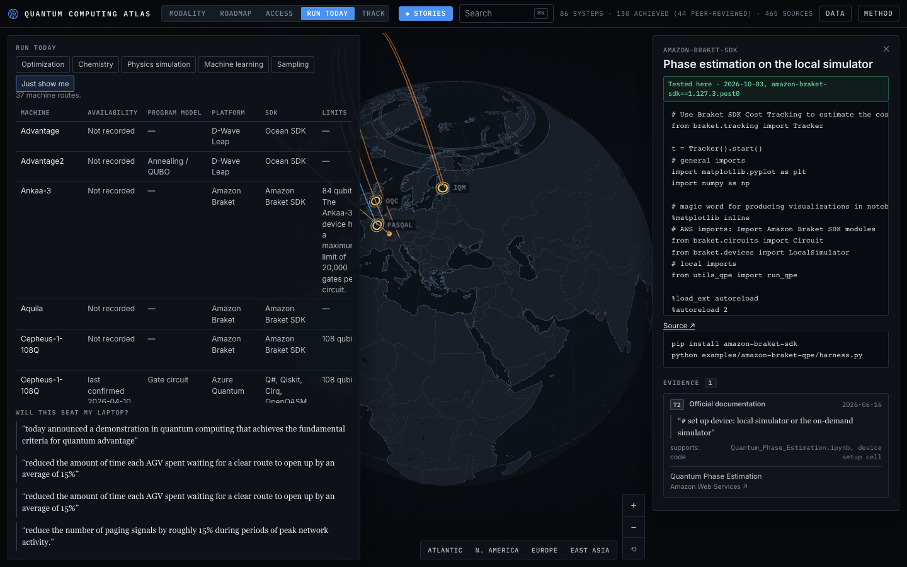
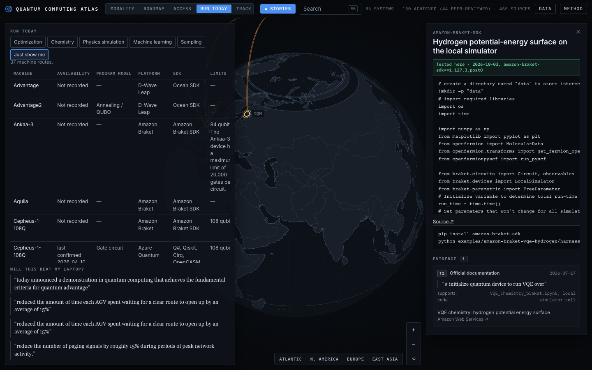
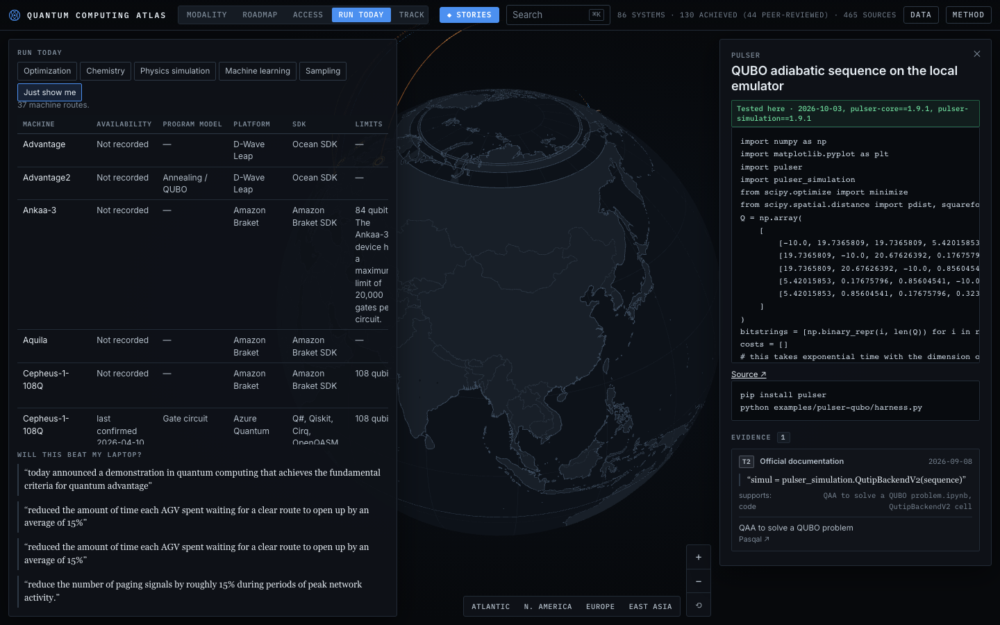
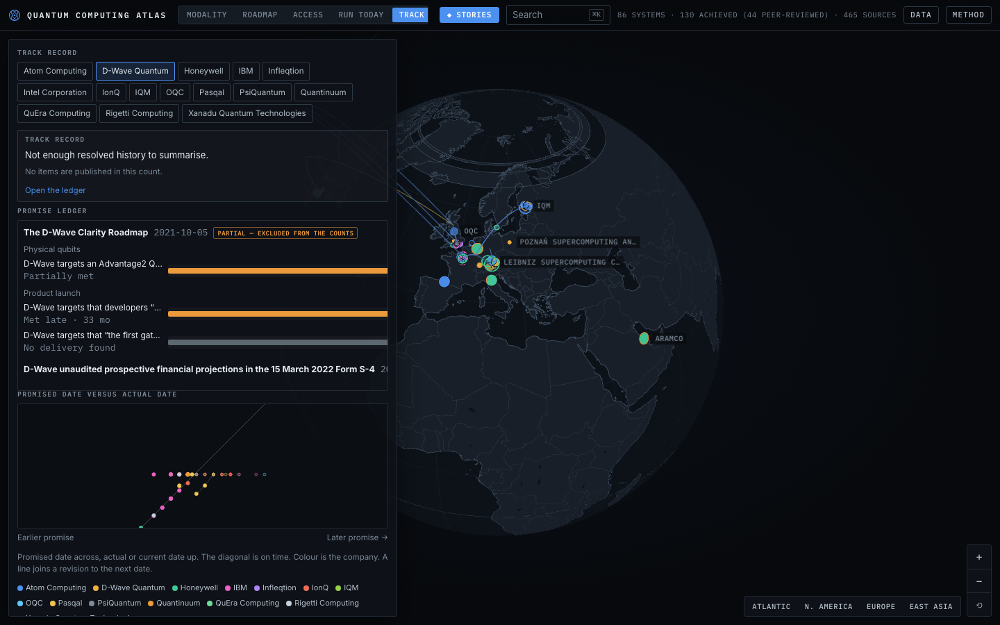
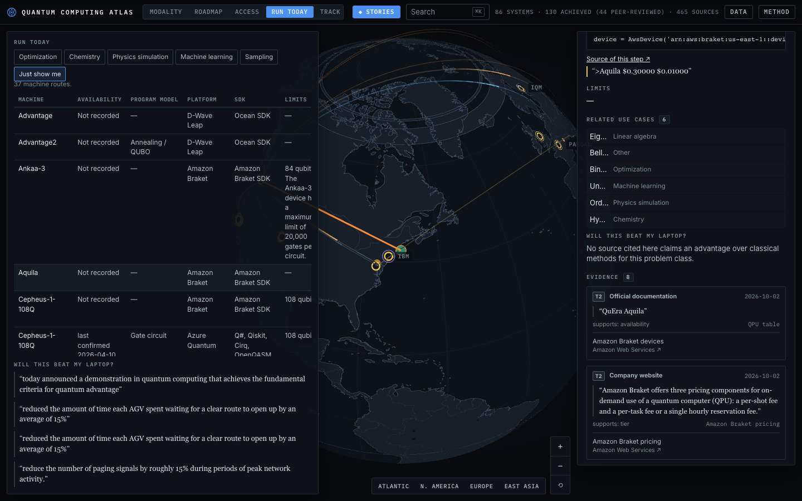

# Quantum Computing Atlas

A 3D globe of the world's quantum computers: who builds them, which qubit technology each uses, what each has **demonstrably achieved**, what each **says it will achieve next**, where the machines physically are, and **how you can submit a program** to them.

Every claim on the globe is tied to a verbatim quote from a primary source: a peer-reviewed paper, an SEC filing, a government award, or the company's own release, roadmap or documentation. A second, independent reviewer re-fetched every document and checked every quote before anything was published. Flagged items show a visible caveat in the inspector. Read a claim next to its source before you rely on it.

## How to look around

Drag to turn the globe. Scroll or pinch to zoom.

Five views sit at the top:

- **Modality** shows machines coloured by qubit technology: superconducting, trapped ion, neutral atom, photonic, spin/silicon, topological, quantum annealing and NV/other. A solid dot sits at a documented site. A fainter dot is drawn at the company's headquarters because no document places the machine anywhere more specific. Hollow dots are announced machines. Arcs show acquisitions, partnerships and government awards.
- **Roadmap** puts achievements and targets on one timeline. Filled dots are things a document says have been done, each labelled peer-reviewed, preprint or company claim. Hollow diamonds are targets ("IBM targets … by 2029"). When a later document moved a target, both versions are kept and linked with a dotted line. Drag the timeline to see the field at any date.
- **Access** draws arcs from cloud platforms to the machines they offer. Click an arc to see the SDKs, the authentication model, the access tier (free, paid, by application or restricted) as the platform's docs state it, a minimal official code example copied verbatim, and whether that example ran on the SDK's local simulator.
- **Run today** is the board of machines a company can submit work to, with the vendor's price, limits, and program model. A row older than 45 days says "last confirmed" and does not say available.
- **Track record** sets a past roadmap date against what was later announced. It shows counts, not a score. A rate appears only when at least three items from a fully captured document are resolved.

Click anything for its quotes and links. **Stories** gives guided walks. **Data** opens every table with CSV export. **Method** explains the evidence rules and lists the known gaps. Search with **⌘K** (Ctrl+K on Windows and Linux).

## Demos

The live app is [quantum-computing-atlas.fly.dev](https://quantum-computing-atlas.fly.dev/). The three "Tested here" programs ran on local simulators, with networking blocked. None of them ran on a QPU. A row older than 45 days says "last confirmed".

### Which machines can take a job now

[Open Run today](https://quantum-computing-atlas.fly.dev/#mode=today). Advantage2 is the annealing machine on this board; it has a program model and no local-simulator badge. [Open that row](https://quantum-computing-atlas.fly.dev/#mode=today&sel=acc:d-wave-leap-advantage2).



### Phase estimation, tested on Braket's local simulator

[Open the example](https://quantum-computing-atlas.fly.dev/#mode=today&sel=ex:amazon-braket-qpe). The green line is the CI result for `amazon-braket-sdk==1.127.3.post0` on 3 October 2026.



### Hydrogen potential-energy surface, same local simulator

[Open the example](https://quantum-computing-atlas.fly.dev/#mode=today&sel=ex:amazon-braket-vqe-hydrogen).



### A Pulser QUBO sequence, tested on Pasqal's local emulator

[Open the example](https://quantum-computing-atlas.fly.dev/#mode=today&sel=ex:pulser-qubo). The harness matches the official tutorial. The badge names `pulser-core==1.9.1` and `pulser-simulation==1.9.1`.



### Promised dates against later announcements

[Open Track record](https://quantum-computing-atlas.fly.dev/#mode=track), on D-Wave. The Clarity roadmap is marked partial, so those items stay out of the counts. The card says there is not enough resolved history to summarise.



### Whether a cited source claims this beats a laptop

[Open Aquila on Braket](https://quantum-computing-atlas.fly.dev/#mode=today&sel=acc:aws-braket-quera-aquila). The inspector states that no source cited there claims an advantage over classical methods for this problem class. The price line is the vendor's text.



## Rules the data follows

- Achievements and targets are never mixed. Targets are drawn hollow and always read "<organisation> targets … by <date>".
- Every achievement shows its peer-review status.
- Contested words ("advantage", "supremacy", "logical qubit", "error-corrected", "fault-tolerant", "beyond-classical", "utility") appear only inside quotation marks, attributed to the source, and verbatim from the item's evidence. The validator, the build and the tests all enforce this.
- Metrics keep the vendor's own definition and are never ranked across vendors. Qubit counts measure size, not capability.
- Logical-qubit counts appear only where the source states the code used.

## Run it yourself

You need Node.js.

```bash
npm install --prefix app
npm run dev
```

Open [http://localhost:5173](http://localhost:5173). The map reads `app/public/atlas.json`, which is in the repo.

To rebuild that file from the research notes:

```bash
node scripts/validate.mjs
node scripts/build.mjs
```

Without `--draft`, the build publishes only what verification approved. `--draft` includes unverified research and puts a DRAFT banner on the map; use it only for local development.

## How the evidence pipeline works

| Stage    | Output                           | What happens |
| -------- | -------------------------------- | ------------ |
| Analysts | `data/research/<topic>.json`     | One research agent per modality group, plus one for access and one for deals and awards, extracts claims with verbatim quotes checked by script against saved copies of each document. Briefs: [docs/ANALYST.md](docs/ANALYST.md), [docs/ACCESS.md](docs/ACCESS.md). |
| Counsel  | `data/verification/<topic>.json` | An independent agent on a different model re-fetches every document, checks every quote, and gives each item a verdict: publish, publish_flagged or reject. See [docs/COUNSEL.md](docs/COUNSEL.md). |
| Build    | `data/build/atlas.json`          | Publishes only approved items, drops failed evidence, applies corrections, re-checks the language rules, and derives each result's peer-review status from its surviving evidence. |

The evidence standard is in [AGENTS.md](AGENTS.md), and the data contract is in [schema/types.ts](schema/types.ts). This project is a fork of the [AI Supply Chain Atlas](https://github.com/luke-mcevoy/ai-supply-chain) pipeline.

## Checks (CI)

Every push runs `.github/workflows/ci.yml`:

- `node scripts/validate.mjs`: structure, cross-references, the hype-term rule, target phrasing, and peer-review status against the cited document types.
- `node scripts/check-build-fresh.mjs`: the committed `app/public/atlas.json` equals a fresh verified build and is never a draft.
- `node scripts/audit-numbers.mjs --ci`: no *new* number in any claim, statement, description or metric definition that isn't in that item's quotes. `data/audit-baseline.json` holds the numbers already confirmed by review.
- `app`: typecheck, unit tests (`npm test`: roadmap separation, revision chains, language rules, integrity of the published data, story grounding), production build, and Playwright browser tests (`npm run smoke`).
- On `main`, when all of that passes, it deploys to Fly if a `FLY_API_TOKEN` repository secret is set; otherwise the deploy step is skipped.
